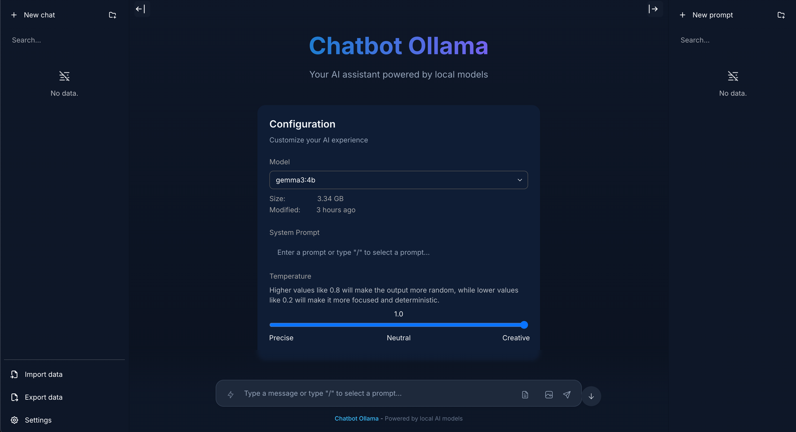
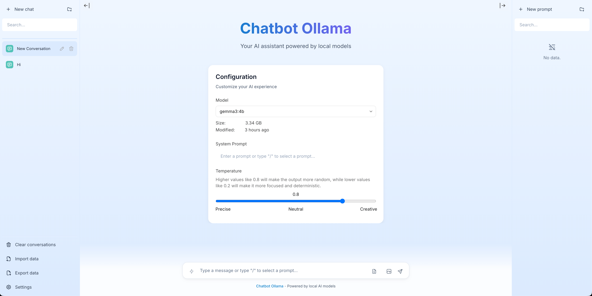

# Chatbot Bangkah

## Tentang

**Chatbot Bangkah** adalah antarmuka chat (chat UI) **sumber terbuka** untuk Ollama yang dikembangkan oleh **Muhammad Dhiyaul Atha**.

Proyek ini merupakan adaptasi dari [Chatbot Ollama](https://github.com/ivanfioravanti/chatbot-ollama), yang awalnya dibuat oleh [Ivan Fioravanti](https://github.com/ivanfioravanti), dan terinspirasi dari [chatbot-ui](https://github.com/mckaywrigley/chatbot-ui) karya [Mckay Wrigley](https://github.com/mckaywrigley).





---

## Sorotan (Fitur Baru)

- Tema biru diperhalus untuk mode terang dan gelap dengan sidebar, header, dan overlay yang konsisten.  
- **Unggah dokumen (PDF, TXT, MD):**
  - File PDF diurai di sisi server agar lebih stabil; teks/markdown dibaca di sisi klien.
  - Seluruh isi (yang telah dipangkas) disertakan secara tersembunyi pada prompt model — antarmuka tetap bersih.
  - Batas ukuran 50 MB, 100 halaman (untuk PDF), dan 50.000 karakter per lampiran.
- **Unggah gambar:** bisa melampirkan gambar dan mengirimkannya ke model yang mendukung penglihatan (*vision-capable*) melalui base64. Model non-vision akan mengabaikannya.
- **Blok kode:** memiliki tombol salin, label bahasa, nomor baris opsional, tombol ganti baris otomatis, serta opsi “unduh sebagai file”.
- **Streaming & kontrol:** tombol *Stop Generation*, pengguliran otomatis (auto-scroll) yang dapat dijeda/dilanjutkan saat pengguna menggulir ke atas.
- **Pintasan keyboard:**
  - `Enter` untuk mengirim pesan, `Shift+Enter` untuk baris baru  
  - `Esc` untuk menghilangkan fokus input  
  - `Ctrl/Cmd+L` untuk menghapus area penulisan  
  - `Arrow Up` untuk memunculkan pesan pengguna terakhir  
- **Penanganan error:** notifikasi (toast) seragam yang menampilkan detail kesalahan, tombol salin detail, dan opsi coba lagi (*Retry*).  
- **Alat percakapan:** tombol salin seluruh percakapan yang terlihat (termasuk label peran dan konten terlampir).  
- **UX Sidebar:** kolom pencarian mengikuti tema, daftar *prompt* menyesuaikan tampilan daftar chat, serta efek hover dan seleksi diperbaiki.

---

## Pembaruan

Chatbot Bangkah akan terus dikembangkan dan diperbarui dari waktu ke waktu oleh **Muhammad Dhiyaul Atha**.

### Fitur Selanjutnya

- [ ] Manajemen model (unduh/hapus)  
- [ ] Dialog info/detail model  
- [ ] Sinkronisasi dengan akun pengguna  
- [ ] Mode offline untuk interaksi tanpa internet  

---

## Docker

**Bangun secara lokal:**
```bash
docker build -t chat-bot .
docker run -p 3000:3000 chat-bot
````

**Atau tarik langsung dari GitHub Container Registry:**

```bash
docker run -p 3000:3000 ghcr.io/Bangkah/chat-bot:main
```

---

## Menjalankan Secara Lokal

### 1. Clone repositori

```bash
git clone https://github.com/Bangkah/chat-bot.git
```

### 2. Pindah ke folder proyek

```bash
cd chat-bot
```

### 3. Instal dependensi

```bash
npm ci
```

### 4. Jalankan server Ollama

Melalui CLI:

```bash
ollama serve
```

Atau lewat [klien desktop Ollama](https://ollama.ai/download)

### 5. Jalankan aplikasi

```bash
npm run dev
```

### 6. Gunakan

Setelah itu, buka browser dan mulai mengobrol langsung dengan AI.

### Tips

* Lampirkan dokumen melalui ikon kertas di kolom pesan — isinya akan dimasukkan ke model secara tersembunyi agar tampilan tetap rapi.
* Lampirkan gambar dengan ikon kamera — model *vision* akan “melihatnya”, sedangkan model biasa akan mengabaikannya.
* Gunakan ikon papan klip di bagian atas untuk menyalin seluruh percakapan saat ini.

---

## Konfigurasi

Saat melakukan *deploy*, kamu dapat mengatur variabel lingkungan berikut:

| Variabel Lingkungan                 | Nilai Default                       | Deskripsi                                          |
| ----------------------------------- | ----------------------------------- | -------------------------------------------------- |
| `DEFAULT_MODEL`                     | `mistral:latest`                    | Model default yang digunakan untuk percakapan baru |
| `NEXT_PUBLIC_DEFAULT_SYSTEM_PROMPT` | [lihat di sini](utils/app/const.ts) | *System prompt* default untuk percakapan baru      |
| `NEXT_PUBLIC_DEFAULT_TEMPERATURE`   | `1`                                 | Nilai *temperature* default untuk percakapan baru  |

---

## Kontak

**Muhammad Dhiyaul Atha**
GitHub: [@Bangkah](https://github.com/Bangkah)
Email: *(mdhyaulatha@gmail.com)*

